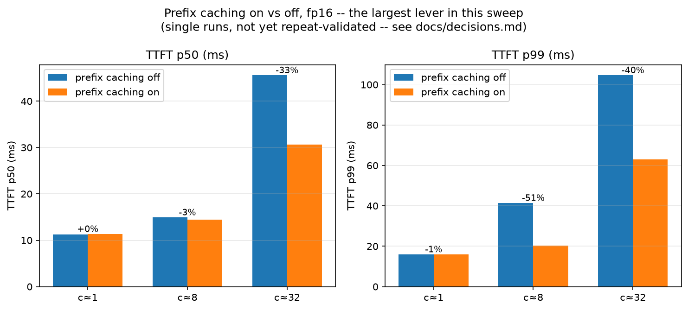
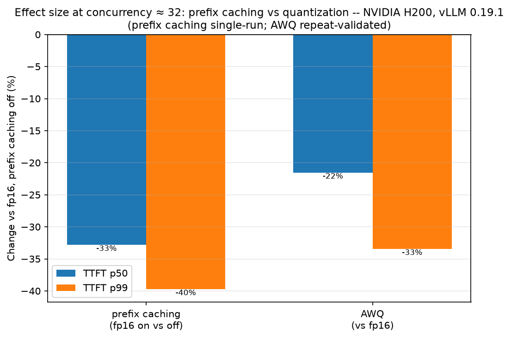
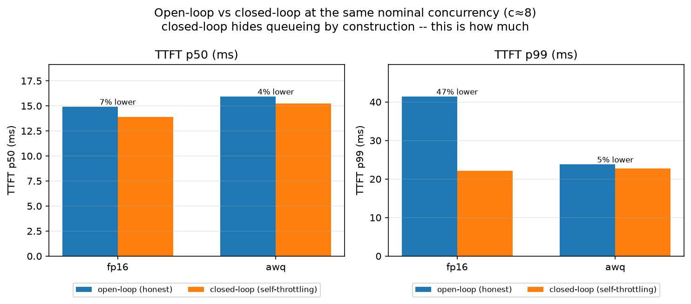
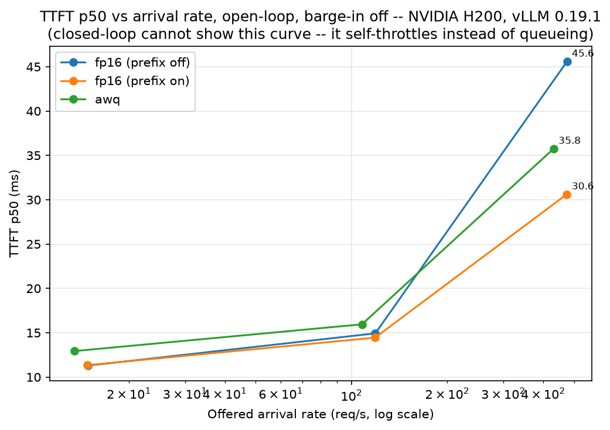
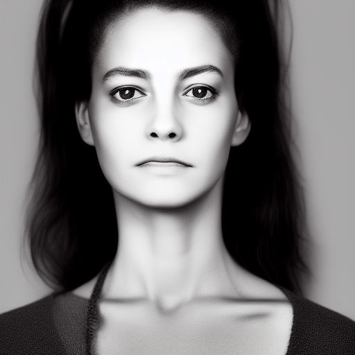
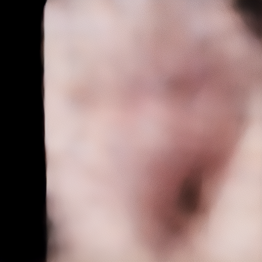
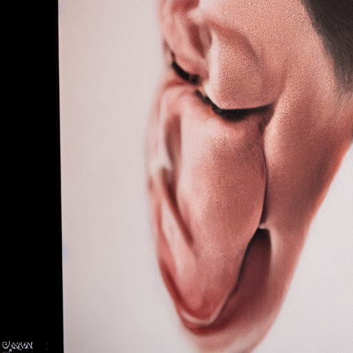

# avatar-inference-bench

A latency and quality benchmark for a real-time conversational avatar's
two costliest components: the LLM-serving backend and the
diffusion-based frame renderer's per-frame cost. Built to show where a
sub-500ms real-time avatar's actual compute budget goes, and which of
the standard optimizations (quantization, fewer denoising steps) do and
don't help at the size and load such a system would actually run --
not to demonstrate techniques in the abstract.

The LLM side is vLLM-served Qwen2.5-1.5B-Instruct under open-loop load,
across quantization arms (AWQ int4, FP8, and unquantized fp16), paired
with a perplexity check (a standard language-model quality metric;
lower is better) for output quality. 1.5B is the size such a system
would realistically serve, not an arbitrary pick -- see "Model size"
under Methodology for why that choice also means the quantization
findings here may not transfer to larger models. The diffusion side is
Stable Diffusion 1.5, staged and timed against a 25fps/40ms real-time
frame budget. Two separate environments and workloads, each scoped to
its own section below -- nothing here compares one against the other.

**LLM serving -- the largest lever is prefix caching (reusing the
KV-cache -- a server's per-token attention memory -- across requests
that share a prompt prefix, instead of recomputing it), not
quantization**, several times larger than any quantization effect
measured, repeat-validated at the load point that matters most --
though this is a best-case number: the workload is 8 fixed, repeated
conversations, exactly what prefix caching is designed to exploit, not
a production traffic distribution (full caveat under Limitations).
**AWQ (a 4-bit weight-quantization method) trades an ~8% perplexity
cost for a 21.6% faster TTFT p50 (median time-to-first-token) at high
concurrency, but is worse on both latency and quality at low
concurrency** -- never the right choice there. **FP8 (8-bit
floating-point quantization) is excluded:** vLLM 0.19.1's online W8A8
path emits corrupted output, a serving-stack defect (issue #29), not a
property of the technique.

**Diffusion -- the binding constraint at 512x512 is fixed cost, not
step count:** conditioning + VAE decode alone is 27.6ms, 69% of a 40ms
real-time frame budget, before any denoising step runs -- the field's
usual lever (fewer steps) can't touch that. DeepCache (a training-free
technique that reuses, rather than recomputes, similar intermediate
network features across nearby denoising steps) -- the one optimization
tried -- speeds up the high-step regime up to 2.82x but is *slower* at
the step count nearest the real budget, with severe quality loss at
both ends.




Every number below traces to a committed script and a committed
`results/*.json` -- reproduction steps in the "Reproduction" section
require no access to anything not in this repo. Full narrative,
pre-registered predictions, and every non-obvious call: `docs/decisions.md`.

## Findings

Environment for everything in this section: RunPod H200 SXM 141GB, vLLM
0.19.1, torch 2.10.0+cu128, FlashAttention v3, Qwen2.5-1.5B-Instruct (+
AWQ). Full spec in "Environment," below. Data: `results/h200/`, generated
by `scripts/analyze.py --results-dir results/h200`.

**Reading this section: two pre-registered, single-run effects have
already failed to reproduce once repeat runs existed.** A single run of
each arm once showed AWQ overtaking fp16 at high concurrency -- a
"crossover." Five repeats per arm showed the gap was inside fp16's own
run-to-run noise; there was no crossover. A single run at concurrency ≈1
once showed prefix caching performing measurably *worse* -- a reversal
from its effect's own direction everywhere else. Five repeats made the
reversal disappear into noise too. Neither was a mistake in the original
measurement -- both were real single-run numbers, honestly reported at
the time. **An effect measured once, near the noise floor, is not
distinguishable from noise, and a plausible mechanism can be constructed
for either outcome after the fact.** Every number below states whether
it's single-run or repeat-validated; that distinction carries more
information than any individual percentage.

### 1. Prefix caching is the largest lever (repeat-validated at c≈32)

At concurrency ≈32, prefix caching on vs. off: TTFT p50 **-32.8%**, p99
**-39.8%**. The off-arm side is repeat-validated (5 seeds, 45.59 ±
2.81ms); the on-arm side is a single run (30.62ms), so the exact
percentage could move somewhat on a repeat pass, but the direction and
rough magnitude are not in doubt. This matches the H100 prior run's own
finding at the same load point (-27.8% p50 / -37.8% p99 there, against
the repeat-validated off-side mean -- see `docs/decisions.md`,
"Corrected results," for the single-run-baseline figure this superseded
and why the two differ) -- same direction, comparable-to-larger
magnitude on H200.

The H100 run's concurrency ≈1 reversal (caching on measurably *worse*)
does not reproduce here: both arms are repeat-validated at c≈1 (off 11.29
± 0.18ms, on 11.35ms, +0.5%/-0.6% -- inside the off-arm's own noise
band). Attributed to noise, not a mechanism that stopped applying -- the
H100 number was never itself repeat-validated.

### 2. AWQ: worse on both axes at low load, a real trade at high load

| Concurrency | fp16 TTFT p50 | AWQ TTFT p50 | Gap |
|---|---|---|---|
| c≈1 (5 seeds each) | 11.29 ± 0.18ms | 12.93 ± 0.18ms | AWQ **+14.5%** slower |
| c≈32 (5 seeds each) | 45.59 ± 2.81ms | 35.76 ± 0.73ms | AWQ **-21.6%** faster |

Both points repeat-validated on both arms, both gaps well outside the
combined noise bands. This contradicts the pre-registered prediction for
this environment, which expected no meaningful high-load difference
(dequant overhead reasoned as a fixed compute cost, unaffected by more
VRAM) -- the same shape the H100 run actually showed. H200 instead shows
a clear ~21.6% AWQ advantage at high concurrency, repeat-validated on
both sides.

**The result stands; only the explanation moved.** This section
originally proposed a bandwidth-bound mechanism -- int4 weights move
"~4x less data" per forward pass, a real win if concurrency ≈32 is
memory-bandwidth-bound. Both halves of that claim turned out wrong.
The byte ratio itself was wrong: `Qwen2.5-1.5B-Instruct`'s safetensors
total 3.09GB (bf16); the AWQ checkpoint's total 1.61GB -- **1.91x, not
4x.** Bit-width alone (16 bits / 4 bits) doesn't give the on-disk byte
ratio, because AWQ's packed int4 weights carry real fp16 scale and
zero-point values alongside them (one pair per quantization group,
typically 128 weights) -- those bytes partially offset the packing win.
And profiling (`docs/decisions.md`, "Phase 8") contradicts the
bandwidth mechanism outright, not merely leaves it unconfirmed: a
bandwidth-relief story predicts AWQ's GEMM kernels take a *smaller*
share of decode-window time than fp16's; instead AWQ's GEMM share is
**71.8%** against fp16's **58.9%** -- higher, not lower. Machete's int4
kernels appear individually slower per call than the bf16 path they
replace (int4 unpacking and per-group dequant run inside the kernel, on
top of the matmul), so AWQ spends *more* wall-clock time in GEMM
kernels despite each one moving fewer bytes from HBM.

Three explanations were profiled against each other, stated with their
current standing rather than a single preferred story:

1. **Bandwidth -- contradicted at the decode level.** The GEMM-share
   result above is the opposite of what "moves less data, so
   proportionally faster" predicts. This doesn't rule out a bandwidth
   effect existing somewhere else in the request lifecycle (prefill
   wasn't isolated -- see below), only that it isn't visible in
   decode-window kernel time, which is where a per-token
   weight-streaming saving would have to show up.
2. **Kernel efficiency -- plausible, not confirmable with this
   tooling.** Machete's int4 GEMMs taking a larger share of
   decode-window time despite moving less data is consistent with a
   genuinely different (not just smaller-input) efficiency profile, but
   distinguishing "compute-bound int4 unpacking overhead" from
   "different achieved bytes/s" needs hardware performance counters
   (`ncu`/Nsight Compute) -- blocked on this pod (a hypervisor-level
   restriction, not fixable from inside the container; see
   `docs/decisions.md`).
3. **Scheduling -- the best-supported observable symptom, with no
   traced cause.** AWQ's realized concurrency at c≈32 runs **~16%
   lower** than fp16's at the same nominal target rate (63.92 ± 1.12
   vs. 76.47 ± 6.67 in-flight requests) -- AWQ queues less under
   identical offered load. Consistent with freed KV-cache headroom
   changing admission behavior, but equally consistent with AWQ simply
   completing requests faster for any reason at all; lower realized
   concurrency is what faster service time mechanically produces under
   either of the other two hypotheses too, so this doesn't distinguish
   itself as a root cause, only as a real symptom.

**What a follow-up needs, and why it wasn't run here:** this profiling
pass captured prefill and decode kernels mixed together in one window
(`record_shapes` wasn't enabled), so a prefill-specific GEMM cost can't
be separated from steady-state decode in the trace. Prefill-phase-
specific profiling -- `record_shapes=True`, or bucketing captured
kernels by request-admission events -- is the next experiment this
points at, not a repeat of this one.

**Profiler-induced disruption, disclosed here and not just in
`docs/decisions.md`:** capturing the trace itself came at a real cost.
The profiling window disrupted request-level scheduling badly enough
that neither pass's own TTFT/ITL/error numbers are usable as evidence
for anything (fp16 TTFT p99 rose to 12.6-91.9s depending on pass,
against a 14s nominal run, with 27-33% of requests erroring
client-side) -- only the trace's internal kernel-category timings are
used above, on the reasoning that CUDA kernel execution time reflects
the GPU work queued, largely independent of how delayed the
surrounding request scheduling was. Two passes, differently disrupted,
agreed closely on kernel-category share (57.8%/74.0% vs. 58.9%/71.8%),
which is why those numbers are trusted despite this.

**What the speed costs, and the most decision-relevant sentence in this
section: at c≈1, AWQ is worse on both axes it will ever be judged on --
8.02% worse perplexity and 14.5% slower. There is no load level tested
here where AWQ is the right choice at low concurrency.**

The 8.02% figure is a cross-slice mean, not a single measurement: 8
distinct, non-overlapping 8192-token wikitext-2 slices, one
forced-decoding pass each, per arm (`results/h200/
perplexity_multislice_awq.json` / `perplexity_multislice_fp16.json`).
AWQ is worse than fp16 on **8 of 8** slices, and the *relative* penalty
is tight even where raw perplexity itself swings nearly 2x across slices
from text difficulty alone (5.97 to 11.38, fp16): **7.14% to 8.72% per
slice, mean 8.02%, sd 0.45 percentage points.** That consistency, not
just the average, is what makes this a real quantization cost rather
than an artifact of which text got measured -- see "Methodology" for why
a single slice repeated couldn't have supplied this.

At c≈32 the story flips to an actual trade: **AWQ trades that same ~8%
quality cost for a 21.6% latency win** -- real on both sides, one
repeat-validated, one cross-slice-validated. The quality cost doesn't
vary with load (it's a property of the weights, not the batch); whether
it buys anything back is entirely a function of where on the load curve
you're operating.

**Limitation, stated plainly:** this is wikitext-2 next-token
perplexity, encyclopedic prose -- not this project's actual multi-turn
conversational workload. It says AWQ's weights carry real, measurable
representational error relative to fp16; it does not say how a human
rating this avatar's actual responses would perceive that error, which
could be smaller or larger than this number implies. See "Limitations."

### 3. FP8 excluded: corrupted output, not a quantization effect

vLLM 0.19.1's online FP8 (`--quantization fp8`, confirmed W8A8 with
dynamic activation scaling, not the H100 run's weight-only static-scale
recipe) produces incoherent, mixed-script output from the first
generated token, not degraded-but-readable text. Full repro command,
sample output, and the `finish_reason` breakdown that confirms it (fp16:
221 `stop` / 1 `length`; FP8: 0 `stop` / 76 `length`, 100% hitting the
generation cap) are in **issue #29** -- that diagnostic was run live
against the server and isn't a committed `results/*.json`, so it's
cited from the issue rather than presented as file-backed here.

What *is* file-backed: the calibration checkpoint that first surfaced
this (`results/h200/calibration_fp8_probe.json`,
`calibration_fp16_pcoff_probe.json`) shows FP8 responses averaging
**78.0 tokens** against fp16's **24.1** -- a **3.2x** gap, with FP8's
range (74-80 tokens, every single sample) sitting right against the
`max_tokens=80` cap it was configured with, while fp16 ranges 10-80
with a median of 20. That pattern alone -- not a single response
shorter than 74 tokens, out of 160 -- is consistent with a model that
isn't emitting a natural stop, independent of the qualitative sample in
the issue.

Ruled out before concluding this was a real bug: chat template and
EOS/sampling config are confirmed byte-identical between arms (same
model repo, same `generation_config.json`, same startup log lines) --
not a harness or config difference. **This is a defect in vLLM 0.19.1's
serving implementation of online FP8**, not a property of FP8
quantization as a technique -- genuine quantization noise degrades
coherence at the margins, it doesn't produce multi-script token soup
hitting the generation cap on every sample. FP8 is excluded from every
H200 table in this document.

### 4. Barge-in lands at every load level (methodology fix, confirmed)

Barge-in: a configurable fraction of requests are aborted mid-stream
after a randomly sampled delay, simulating a user interrupting the
avatar while it's still speaking. The harness measures whether the
abort actually lands before the response would have finished on its
own, and what that costs other in-flight requests sharing the server.

| | c≈1 | c≈8 | c≈32 |
|---|---|---|---|
| H100 fp16 abort rate (fixed 0.3-1.2s window) | 0% | 0% | 0.10% |
| H200 fp16 abort rate (window scaled to 25-75% of calibrated service time) | 25.5% | 25.4% | 25.6% |

*Not a direct comparison: the two rows use different abort-window
designs (fixed delay vs. scaled to each arm's own service time --
that's the fix this section is about, explained below), not two
measurements of the same thing on two GPUs. Read down a row, not
across the table.*

The H100 run's fixed abort-delay window meant barge-in was effectively
only tested at one of three load points -- the delay was longer than the
response itself at low and mid load, so it essentially never fired
before the request completed on its own. Scaling the window to each
arm's own calibrated service time fixes this: observed abort rates now
match the sampled 25% fraction closely at every concurrency, both arms
(fp16 25.3-25.6%, AWQ 25.7-26.0% across c1/c8/c32).

**Caveat at c≈32, disclosed rather than smoothed over:** the window is
sized off *unqueued* service time (the concurrency=1 calibration probe).
At c≈32, queueing measurably inflates actual wait time, so a real
fraction of aborts land during the queueing/TTFT phase rather than
post-TTFT decode -- `abort_before_first_token` is 0.0-0.9% at c≈1/c≈8
(aborts land mid-decode, as intended) but **11.6-26.5% at c≈32** (fp16
26.5%, AWQ 11.6%). This was predicted in `scripts/sweep.sh`'s own
comment before this run, not discovered after the fact. See
"Limitations."

### 5. KV-cache arithmetic validated

Expected bytes/token, from the model's own config (28 layers, 2 KV
heads, 128 head_dim, 2 bytes/element):

```
28 x 2 x 128 x 2 (K and V) x 2 bytes = 28,672 bytes/token
```

`results/h200/server_log_fp16_pcoff.txt` / `server_log_awq.txt`
(committed server startup logs) report vLLM's own allocation directly:
120.53 GiB / 4,513,888 tokens (fp16), 122.29 GiB / 4,579,824 tokens
(AWQ). Dividing gives vLLM's own implied bytes/token: **28,671.09**
(fp16), **28,670.95** (AWQ) against **28,672** expected -- agreement to
within the rounding vLLM's own log applies before printing GiB to two
decimal places. This validates bytes-per-token from a live allocation,
not a per-sequence or per-max-context figure -- vLLM's paged allocator
reserves blocks per token a sequence has actually generated, not its
full 32,768-token context length up front.

### Data integrity: one run was excluded and re-run, disclosed here

`fp16_pcoff_open_c8_bargein0.0` initially returned TTFT p99 = 5.3
seconds -- 581 of 2178 requests took over 1 second to first token,
decaying from ~5.1s mean at the start of the run to steady-state ~16ms
by 7 seconds in. Checked against every other one of the 34 other result
files' own load-level transitions: none show anything resembling this
pattern (worst case elsewhere: tens of milliseconds). Isolated to this
one run. Re-ran the identical configuration on a freshly started server:
clean (p50 14.9ms, p99 41.4ms, in line with every other concurrency-8
cell). **The committed file is the clean re-run, not the original.**
Excluding a one-off outlier that doesn't recur anywhere else is a normal
part of running a sweep; not disclosing it is not.

## Methodology

This is the part of the repo that took the most iteration, and the part
most worth reading closely if you're deciding whether to trust the
numbers above.

**Model size, stated explicitly rather than left for a reader to
notice.** Qwen2.5-1.5B-Instruct is not an arbitrary or convenient
choice -- it's roughly the size a real-time conversational avatar would
actually serve. A sub-500ms voice/video turnaround budget has to split
across ASR, LLM generation, TTS, and (per the Diffusion section, below)
frame rendering; an LLM alone has to fit in a fraction of that, which
rules out anything in the 7B+ range this sweep doesn't test. **This
choice has a direct, disclosed consequence for what the quantization
findings mean:** a 1.5B model's weights are a few GB, and even
unquantized they leave enormous KV-cache headroom on an 80-141GB card
(`docs/decisions.md`, "Predictions, stated before measuring (Phase 3
sweep)") -- there is almost no memory pressure here for quantization to
relieve. AWQ and FP8's tradeoffs (and prefix caching's KV-cache-reuse
benefit) could plausibly look different, in either direction, at a size
where weights and KV-cache actually compete for VRAM. **Nothing in this
repo tests that. The quantization and prefix-caching findings below are
scoped to this model size and may not transfer to 7B+.**

**Workload.** `harness.py` drives an OpenAI-compatible chat-completions
endpoint with a fixed set of 8 short multi-turn conversations, measuring
TTFT (time to first token), ITL (inter-token latency), E2E, and
`finish_reason` per request. Two load modes: **open-loop** (Poisson
arrivals at a fixed rate -- queueing shows up honestly in TTFT) and
**closed-loop** (N workers, each starting a new turn only after its last
finished -- self-throttling, hides overload). The sweep is open-loop by
design; closed-loop is reported only as a contrast, never a headline
number:



At the same nominal concurrency (c≈8), closed-loop's self-throttling
makes every arm look meaningfully better than the open-loop number the
same server actually produced (H200: fp16 p50 6.8% / p99 46.6% better;
AWQ p50 4.4% / p99 4.7% better -- see `results/h200/summary.md`).

**Concurrency targeting.** Offered concurrency is held constant across
arms, not arrival rate. Each arm's arrival rate is derived independently
via Little's Law (queueing theory's `L = λW`: average requests in
flight = arrival rate × average time each spends in the system --
`scripts/calibrate.py`, measuring low-load, unqueued service time per
arm) to target the same concurrency (~1/8/32) for every arm. Holding arrival rate constant instead would mean a faster
arm gets evaluated at automatically lower concurrency than a slower
one -- the axis this sweep measures would shift underneath the
comparison. "Concurrency ≈ N" names the *offered* load implied by that
calibration, not a guaranteed realized average -- under real queueing
near saturation, realized concurrency can run higher than the target.



**Repeat validation.** The quantization comparison and the c≈1/c≈32
prefix-caching cells run 5 seeds each (`scripts/repeat_check.py`),
reported as mean ± stdev, not a single-run point estimate. This exists
because it already caught two false findings: a single-run "AWQ
crossover" that repeat runs showed was noise, and a single-run
prefix-caching reversal at c≈1 that repeat runs made disappear (see
"Findings," above). Every number in this document that isn't marked
"single-run" is one of these repeat-validated cells; single-run numbers
are stated as such, not implied to carry the same weight.

**Predict-before-measure.** Every quantization arm and every hardware
change has a prediction recorded in `docs/decisions.md` *before* the
run that tested it -- what was expected, what magnitude would be a
surprise, and what would falsify it. AWQ's H200 high-load advantage
(finding 2, above) is the clearest example of a prediction the data
contradicted outright, written up as a contradiction rather than
smoothed into a retrofit explanation.

**A wrong mechanism can get written down even when the data to catch
it is already committed.** AWQ's c≈32 TTFT advantage was first
explained as a decode-phase bandwidth effect -- despite the 5-seed
repeat data already on file showing ITL (steady-state decode) barely
differs between arms: fp16 6.142 ± 0.876ms vs. AWQ 5.844ms, a
0.298ms/4.85% gap smaller than fp16's own run-to-run noise, while the
clean, repeat-validated 21.6% effect sits entirely in TTFT. A
decode-phase weight-streaming saving would have to show up in ITL; it
doesn't. That split was sitting in already-committed
`results/h200/repeat_{fp16,awq}_c32_seed*.json` files before any
profiler ran. The kernel-level profiling in finding 2 confirmed what
those numbers already implied (AWQ's GEMM share of decode time turned
out *higher*, not lower) -- it didn't discover something new, it caught
a mechanism claim the existing data already argued against. Read the
noise bands on repeat-validated numbers before reaching for a
mechanism, not only before reporting the headline effect.

**Perplexity: forced-decoding, and why the noise band has to come from
different text, not repeats.** Perplexity is measured against the
*same* live server every latency number comes from -- not a separate
offline model load -- via `/v1/completions` with
`max_tokens=0, echo=True, prompt_logprobs=0`. The server never samples
anything; for each real token after the first, it reports the
log-probability it assigned to that exact token given everything before
it. NLL = -mean(those logprobs); PPL = exp(NLL). This request shape was
confirmed against a live server before writing the measurement script,
not assumed from vLLM's source.

The first version of this measurement (`scripts/perplexity.py`,
`results/h200/perplexity_fp16.json` / `perplexity_awq.json`) repeated one
fixed 8192-token slice 5 times per arm. Every repeat, both arms, came
back **bit-identical** (stdev 0.0). That's not a noise band -- forced-decoding
a fixed input against fixed weights with no sampling has no source of
randomness, so repeating it can't produce variance; it confirms the
serving path is bit-reproducible under these conditions (worth knowing
on its own terms), but it supplies no error bar an arm-to-arm delta can
be checked against. The fix: 8 distinct, non-overlapping wikitext-2
slices (`scripts/build_perplexity_slices.py`), one forced-decoding pass
each (`scripts/perplexity_multislice.py`), mean/sd taken *across slices*
-- variance across text samples, the uncertainty that actually applies
to a claim like "AWQ costs 8% perplexity." Both scripts, and both
versions of the measurement, are committed; the single-slice-repeat
result is kept as the determinism finding, not deleted for having been
the wrong axis to vary.

**Provenance.** Every `results/*.json` embeds a provenance block
(`bench/provenance.py`): git SHA (from local git, or shipped via
environment variable when code reaches the pod through `git archive`,
which strips `.git`), GPU name/driver, vLLM version (asked of the
*running server*, not a local import -- the server may be on a different
version than whatever's installed on the machine driving the
benchmark), model, and full CLI args. No result in this repo is missing
this block.

**Safety nets that caught real bugs, kept in place:**
- `scripts/sweep.sh` confirms `vllm:kv_cache_usage_perc` reads ~0 right
  after every server restart, rather than assuming a fresh process
  implies a cold cache.
- `scripts/analyze.py`'s `assert_full_classification()` requires every
  `results/*.json` file to match a known naming pattern or be listed as
  intentionally excluded with a reason -- raises loudly, listing exactly
  which files, rather than silently dropping an unrecognized file from
  every table and plot. Caught a real naming mismatch once
  (`fp16_closed_c8.json`) that had already silently vanished from a
  table; caught the Phase-4 perplexity result files failing
  classification during this rewrite, fixed by adding them to the
  intentionally-excluded list with a reason (they're a different kind of
  measurement, not a load-sweep cell).

## Environment and the H100 prior run

Two environments appear in this repo. **No table, plot, or claim mixes
numbers across them.** The H200 environment (above) is current and
reproducible; the H100 environment is a prior run whose pod was
reclaimed -- its results are kept, unchanged, as a labeled historical
data point, not deleted or silently superseded.

### H200 (current -- produced every number in "Findings," above)

- **Hardware:** RunPod, single H200 SXM 141GB (143771 MiB per
  `nvidia-smi`). Driver `570.124.06`, host CUDA 12.8. A redeploy was
  attempted specifically to check whether the CUDA-12.8 ceiling was one
  pod's problem or the allocation's -- the second pod reported the same
  driver and the same container hostname, so it's the allocation's
  ceiling, not a fluke.
- **Serving:** `vllm serve` `0.19.1` -- not the newer `0.26.0` used on
  H100. `pip install vllm` resolves `0.26.0` + `torch==2.11.0+cu130` by
  default, same as H100, but this driver only supports CUDA 12.8, and
  torch 2.11's default wheel is the first to move to a CUDA-13 runtime
  -- that combination can't initialize CUDA at all here
  (`RuntimeError: The NVIDIA driver on your system is too old`).
  `0.19.1` is the newest vLLM release still pinning `torch==2.10.0`
  (CUDA 12.8-compatible); confirmed empirically (server starts, model
  loads, serves a request), not just installed. See
  `docs/decisions.md`, "H200 environment rebuild," for the version
  search that found this.
- **Resolved environment: `requirements-pod-h200.txt`** (a `pip freeze`
  off this pod after install) -- the source of truth for exact
  versions, not any container tag. Notably: `torch==2.10.0+cu128`, no
  `flash-attn` package, `flashinfer-python==0.6.6` installed but **not**
  the attention backend actually selected -- vLLM 0.19.1 picks
  `FLASH_ATTN` (FlashAttention v3) here.
- **Model:** `Qwen/Qwen2.5-1.5B-Instruct` and
  `Qwen/Qwen2.5-1.5B-Instruct-AWQ` (AWQ auto-selects `awq_marlin` ->
  `MacheteLinearKernel`). FP8 (`--quantization fp8`) loads and serves
  but is excluded from every result table -- see Findings, #3.
- **Workload, load design, orchestration:** `harness.py` /
  `scripts/calibrate.py` / `scripts/sweep.sh`, with four methodology
  improvements folded in for this run: scaled barge-in window (see
  Findings, #4), server startup logs captured and committed per run,
  repeats built into the sweep matrix rather than a manual follow-up
  pass, and the file-classification safety net (see "Methodology").

### H100 (prior run -- pod reclaimed, not reproducible; results kept as-is)

- **Hardware:** RunPod, single H100 80GB HBM3. Driver `580.126.09`, host
  CUDA 13.0.
- **Serving:** `vllm serve` `0.26.0`, `torch==2.11.0+cu130` --
  `requirements-pod-h100.txt` is the resolved-environment source of
  truth. `flashinfer-python==0.6.14` as the attention backend (not
  FlashAttention).
- **Model:** same fp16/AWQ arms, plus an on-the-fly FP8 variant
  (`--quantization fp8_per_tensor`) that **is a different intervention
  than the H200 FP8 flag** -- weight-only, static-scale (weights move to
  `torch.float8_e4m3fn`, activations stay in bf16), confirmed by reading
  the resolved `QuantizationConfigArgs` directly. Any FP8 number below
  is about this weight-only arm specifically.
- **Four variables differ from H200, independently: GPU, vLLM version,
  attention backend, and FP8 semantics.** Not one. Full reasoning:
  `docs/decisions.md`, "The H200 run is a fresh baseline, not a
  continuation."

**H100's own headline numbers, repeat-validated (5 seeds, c≈1 and c≈32,
prefix caching off):**

| | c≈1 (p50) | c≈32 (p50) |
|---|---|---|
| fp16 | 8.39 ± 0.05ms | 37.31 ± 2.43ms |
| AWQ | 10.47 ± 0.37ms | 37.79 ± 0.76ms |
| FP8 (weight-only, static-scale) | 8.23 ± 0.11ms | 42.43 ± 2.05ms |

AWQ is clearly slower at low load (dequant overhead, never
bandwidth-bound at this batch size); at c≈32 the fp16/AWQ gap (0.48ms)
is inside fp16's own run-to-run noise (±2.43ms) -- no measurable
difference on this hardware, in contrast with H200's clear advantage
(Findings, #2). FP8 (weight-only) is real in both directions:
marginally faster at low load, ~14% slower at high load once the
workload turns compute-bound. Prefix caching was this run's largest
lever too (fp16 on vs. off at c≈32: TTFT p50 -27.8%, single-run both
sides; p99 -37.8%, on-side single-run against the off-side's later
5-seed repeat-validated mean -- `docs/decisions.md`, "Corrected
results," discloses both this figure and the single-run-only 45%
number it superseded). Perplexity/quality was never measured on this
run -- see
Findings for the H200 measurement instead; nothing pairs an H100 latency
number with an H200 quality number.


Full H100 narrative, tables, and plots as originally written:
`results/summary.md`, `docs/decisions.md`.

## Diffusion frame budget (Phase 6)

**A different environment and a different workload from everything
above -- no vLLM, no server, plain `diffusers` on the same H200 pod.**
Stable Diffusion 1.5, fp16, DPM-Solver++ (a fast ODE solver for the
denoising schedule, chosen for its low-step-count quality -- the
relevant property for a step-count-constrained real-time budget),
512x512 (SD1.5's native resolution). A proxy for a real-time avatar's
frame renderer, not the
thing itself: no lip-sync, no audio conditioning, no temporal
consistency across frames, no actual avatar-specific model -- a
standard text-to-image diffusion model's per-frame cost structure,
measured against the budget a real system would face. Data:
`results/h200/diffusion/`, model choice and pre-registered hypothesis
in `docs/decisions.md`.

**512x512 real-time video is ~25fps, a 40ms/frame budget. Every stage
below is timed separately with `torch.cuda.synchronize()` bracketing
it, one warmup generation discarded first -- an unsynchronized or
unwarmed timing reads 100-300ms of pure CUDA/cuDNN warmup as if it were
real cost; see `docs/decisions.md` for the before/after numbers that
caught this.**

### The fixed cost, not the ceiling, is the finding

| Steps | conditioning (ms) | one denoising step (ms) | VAE decode (ms) | total (ms) |
|---|---|---|---|---|
| 1 | 6.61 | 18.74 | 20.98 | 46.33 |
| 4 | 6.48 | 18.35 | 21.00 | 100.89 |
| 20 | 6.56 | 18.17 | 21.02 | 390.99 |

(5 repeats per cell, full table across 8 step counts in
`docs/decisions.md`; noise bands mostly under 3% of the mean --
compute-bound GPU work, not a queued serving system.)

**Mean conditioning (6.58ms) + mean VAE decode (21.00ms) = 27.57ms of
fixed cost, 68.9% of the 40ms budget, before a single denoising step
runs.** Step count -- the lever the field's own acceleration methods
(DeepCache, TeaCache) are built around -- is not the binding constraint
at this resolution: a hypothetical zero-step model would still cost
27.57ms and still consume 69% of the budget. **The number worth
optimizing is the fixed cost, not the step count.** (This is
resolution-specific -- VAE decode cost scales with output resolution,
so 68.9% is a 512x512 number, not a general one; see Limitations.)

The ceiling itself, secondary to the point above but part of what was
asked: no step count fits 40ms, not even 1 (46.33ms, several times
outside the noise band). 3 steps fits the looser 100ms reference point
(84.42ms); 4 narrowly misses it (100.89ms).

**Pre-registered before this measurement ran (`docs/decisions.md`):
VAE decode should be comparable in magnitude to one denoising step, not
a rounding error, since both are single fixed-cost forward passes
through comparably-sized networks. Held, more strongly than
predicted** -- VAE decode (~21.0ms) is slightly *larger* than one step
(~18-19ms), and at 1 step it's 45% of total frame time on its own.

### LPIPS ranked the more-degraded image as closer to baseline

LPIPS (Learned Perceptual Image Patch Similarity) is a neural-network-
based distance metric between two images -- lower means more similar,
per the network's learned notion of perceptual similarity, not raw
pixel difference. The most useful methodological result in this repo,
not because the metric is unusual (LPIPS is the standard choice for
this exact comparison -- the same family DeepCache's and TeaCache's own
papers use) but because trusting it alone here would have shipped the
wrong conclusion.

| Steps | LPIPS distance (DeepCache vs. no-cache, same seed) |
|---|---|
| 4 | 0.4801 |
| 20 | 0.6776 |

Read as numbers alone: caching costs *less* quality at steps=4 (nearest
the real budget) than at steps=20. **That's backwards.**

| | no cache | DeepCache |
|---|---|---|
| steps=4 |  |  |
| steps=20 |  |  |

At steps=20, DeepCache changes the *composition* -- both frames are
sharp and detailed, but they're different pictures (a full-face
portrait vs. a close-up of a different facial region), same seed. At
steps=4, DeepCache doesn't change the composition so much as erase it
-- an already low-detail non-cached frame becomes a near-featureless
blur. **The steps=4 pair looks more "similar" to LPIPS only because two
blurry images resemble each other more than two sharp, different ones
do** -- the metric reads texture/edge agreement, and there's little
texture in either steps=4 frame to disagree about. For this project's
actual question (does caching preserve the output at the step count
that matters), steps=4 is the worse failure, and LPIPS ranked it
better.

**Stated plainly: read on its own, LPIPS would have supported exactly
the wrong conclusion -- that DeepCache's quality cost shrinks in the
low-step regime the real-time budget forces, when the opposite is
true. The only reason this didn't ship as a finding is that the images
were pulled and looked at before the number was trusted.** Full
mechanism discussion: `docs/decisions.md`.

### DeepCache, honestly scoped

| Steps | no cache (ms) | DeepCache (ms) | speedup |
|---|---|---|---|
| 1 | 46.33 | 49.27 | **0.94x (slower)** |
| 4 | 100.89 | 52.04 | 1.94x |
| 20 | 390.99 | 138.75 | **2.82x** |

(`--cache-interval 5 --cache-branch 0`, the DeepCache paper's
commonly-cited SD1.5 default -- one fixed setting, not tuned per step
count; full 8-point table in `docs/decisions.md`.)

**The headline number (2.82x at steps=20) and its honest scope: at the
one step count closest to the model actually meeting the real-time
budget, DeepCache is slower, not faster.** At N=1 there's no later step
to reuse a cached computation from, so the caching machinery is pure
overhead with no offsetting benefit. Speedup only turns clearly
positive at N>=2 and only gets large at N>=5 -- past the point (N=3)
that fits even the loose 100ms reference budget. **The standard
acceleration technique for this class of model gives its largest
benefit exactly where a real-time avatar's own budget rules step count
out, and gives a regression where the budget actually forces it.**

Paired with the quality-cost section above: severe quality loss at
both step counts checked, worst at the step count nearest the real
budget -- DeepCache is not a way around the fixed-cost finding at the
top of this section, at any step count tested.

**The speedup curve isn't smooth, and that's explicable, not noise:**
2.43x at N=5 drops to 2.18x at N=8, despite N=8 having more steps.
`cache_interval=5` means 1 step in every 5 is "real" (full
computation); what fraction of a given N is real depends on N mod 5,
not on N being larger. N=5: 1 of 5 steps real (20%). N=8: 2 of 8 steps
real (steps 0 and 5 -- 25%). A larger real-step fraction means less
caching and less speedup, so N=8's smaller speedup is predicted by this
mechanism in advance, not just observed after the fact -- a sawtooth
following N mod `cache_interval`, not measurement noise (largest total-
time stdev across every cell in this section is 3.27ms, at N=1
DeepCache, against gaps of tens of ms between adjacent step counts).

## Reproduction

Every number above comes from a committed script reading committed
`results/*.json` or `results/h200/*.json` -- nothing is hand-typed.
**Only the H200 environment is reproducible today** (the H100 pod was
reclaimed; its results are a static historical artifact -- `make
analyze` still regenerates its tables/plots from the committed JSON,
but there's no live pod left to re-run its sweep against).

### GPU-free steps (no pod, no server -- run these anywhere)

```bash
pip install -r requirements.txt  # matplotlib only
make analyze       # H100 tables + plots, from committed results/*.json
make analyze-h200  # H200 tables + plots, from committed results/h200/*.json
make kv-check      # KV-cache arithmetic, no server needed
```

### Provisioning an H200 pod and rebuilding the environment

1. Provision a RunPod H200 SXM pod (Ubuntu 24.04 base). Confirm the
   driver before doing anything else -- this repo's whole vLLM-version
   story follows from one fact:
   ```bash
   nvidia-smi --query-gpu=name,driver_version --format=csv
   # NVIDIA H200, 570.124.06  ->  CUDA 12.8 ceiling, read on
   ```
2. Install vLLM. **Do not let this silently resolve `0.26.0`** -- on a
   driver capped at CUDA 12.8, that version's default torch dependency
   (`torch==2.11.0+cu130`) can't initialize CUDA at all:
   ```bash
   pip install vllm --break-system-packages
   pip show vllm   # confirm it landed on 0.19.1, not 0.26.0
   ```
   If a future `pip install vllm` resolves a newer version by default,
   pin explicitly (`pip install vllm==0.19.1 --break-system-packages`)
   until the driver changes. `requirements-pod-h200.txt` is the exact
   `pip freeze` this repo's numbers came from, for comparison, not a
   literal install target -- it's a full environment snapshot, not a
   minimal dependency list.
3. **`tmux` is a hard dependency, not optional.** `scripts/sweep.sh` and
   `scripts/perplexity_sweep.sh` (step 5, below) both launch the vLLM
   server inside a detached `tmux` session so the script can poll it,
   kill it, and restart it between arms without the server dying when
   the SSH connection that started it does. Confirm it's present before
   running either script -- it was already installed on the RunPod
   PyTorch template this repo's own numbers came from, but that's not
   guaranteed on every base image:
   ```bash
   which tmux || apt-get install -y tmux
   ```
4. Ship this repo to the pod (no `.git` needed on the pod side --
   `git archive` strips it, so provenance capture falls back to
   environment variables set at ship time):
   ```bash
   GIT_SHA=$(git rev-parse HEAD)
   GIT_DIRTY=$(git status --porcelain | grep -q . && echo true || echo false)
   git archive HEAD | ssh <pod> "mkdir -p /workspace/multimodal-avatar && tar -x -C /workspace/multimodal-avatar"
   ```
5. Run the sweeps, from the pod, with the same SHA/dirty flag shipped as
   environment variables so provenance blocks match what was actually
   pushed:
   ```bash
   ssh <pod> "cd /workspace/multimodal-avatar && \
     PROVENANCE_GIT_SHA=$GIT_SHA PROVENANCE_GIT_DIRTY=$GIT_DIRTY \
     scripts/sweep.sh"                 # latency sweep -> results/h200/
   ssh <pod> "cd /workspace/multimodal-avatar && \
     PROVENANCE_GIT_SHA=$GIT_SHA PROVENANCE_GIT_DIRTY=$GIT_DIRTY \
     scripts/perplexity_sweep.sh"      # perplexity -> results/h200/
   ```
6. Pull results back and regenerate tables/plots:
   ```bash
   scp -r <pod>:/workspace/multimodal-avatar/results/h200 results/
   make analyze-h200
   ```

### Rebuilding the wikitext-2 slices (one-time, offline, no GPU)

Only needed if the slice count/length ever changes --
`data/wikitext2_test_slices*` is already committed:

```bash
pip install pyarrow transformers huggingface_hub   # not in requirements.txt, see docs/decisions.md
make perplexity-slices
```

### Diffusion frame budget (no vLLM, no server -- any CUDA GPU)

`requirements-pod-diffusion.txt` layers on top of a normal CUDA/torch
install -- deliberately does not need `requirements-pod-h200.txt`'s
CUDA-12.8 pin, since this phase runs with vLLM out of the picture. This
pod's base image enforces PEP 668 (`externally-managed-environment`) --
same reason the vLLM install above needs `--break-system-packages`;
omitting it here fails the same way:

```bash
pip install -r requirements-pod-diffusion.txt --break-system-packages
make diffusion          # step-count sweep, with and without DeepCache -> results/h200/diffusion/
make diffusion-quality  # LPIPS between a DeepCache frame and its non-cached baseline
```

### What's not reproducible

- The H100 sweep: pod reclaimed, no live environment to re-run against.
  `make analyze` regenerates its tables/plots from the committed JSON
  only.
- The FP8 sample output and `finish_reason` breakdown cited in Findings
  #3 came from a live diagnostic against the pod, not a committed
  results file -- the exact repro command is in issue #29 and should
  reproduce the same corrupted output against any H200 pod on vLLM
  0.19.1.

## Limitations

- **Scope: LLM serving latency/quality, and diffusion per-frame cost --
  not an avatar system.** This benchmarks the language-model serving
  backend (TTFT, ITL, quantization, output quality under load) and a
  diffusion model's per-frame stage cost against a real-time budget. It
  does not measure audio, lip-sync, temporal consistency across frames,
  or any actual avatar-specific model, and it does not connect the two
  workloads' numbers -- no combined "avatar frame budget" is computed
  anywhere in this repo. No avatar system was built or benchmarked
  here, in whole or in part.
- **Prefix caching's effect is a best case.** The workload is 8 fixed,
  byte-identical conversations, repeated -- exactly what prefix caching
  is designed to exploit. A production workload with a long tail of
  distinct conversations would see a smaller effect than the -32.8%/
  -39.8% reported here; this number is an upper bound on the lever, not
  a general prediction. (Issue #6.)
- **One model, one size, chosen deliberately (see "Model size" under
  Methodology), but still untested at any other size.** Everything here
  is Qwen2.5-1.5B-Instruct. None of it generalizes to other model
  families or sizes -- quantization cost and prefix-caching benefit both
  plausibly scale differently with model size, and 1.5B specifically has
  little memory pressure for quantization to relieve in the first place,
  untested at a size where that would differ.
- **Barge-in at c≈32 is confounded by queueing.** The abort window is
  sized off unqueued (c≈1) service time; at c≈32, real queueing inflates
  actual wait time, so 11.6-26.5% of aborts land during the queueing/TTFT
  phase rather than mid-decode as intended at lower concurrency
  (Findings, #4). The within-arm with/without-abort comparison is
  unaffected; the *load-level comparison* of abort timing is not
  apples-to-apples at c≈32.
- **FP8 is unmeasured on H200.** Excluded for a real, confirmed defect
  (Findings, #3; issue #29, open), not a design choice -- there is
  currently no FP8 latency or quality number for this environment, and
  none should be inferred from the H100 run, which used a different FP8
  recipe on different hardware.
- **Wikitext perplexity is a proxy, not a validated measure of this
  workload's quality.** It's encyclopedic next-token prediction; this
  project's actual workload is short-form multi-turn conversational
  dialogue. The 8.02% AWQ perplexity cost says AWQ's weights carry real
  representational error -- it does not establish how that error would
  be perceived in an actual avatar conversation, which could show a
  smaller or larger effect.
- **AWQ's high-concurrency advantage is now profiled, and the
  mechanism is still open -- a different open question than before.**
  Kernel-level profiling (Findings, #2; `docs/decisions.md`, "Phase 8")
  contradicts, rather than merely leaves unconfirmed, the bandwidth-
  bound mechanism this repo originally proposed: AWQ's GEMM kernels
  take a *larger* share of decode-window time (71.8%) than fp16's
  (58.9%), the opposite of what a bandwidth-relief story predicts.
  What's still open is which of two remaining explanations accounts
  for the effect -- Machete's int4 kernels being less compute-efficient
  per call (plausible, needs `ncu` hardware counters this pod's
  hypervisor blocks) or a scheduling/admission effect showing up as
  AWQ's ~16% lower realized concurrency at the same nominal load (a
  real symptom, not yet traced to a cause) -- and this profiling pass
  can't isolate one from the other, nor separate prefill-phase cost
  from steady-state decode (`record_shapes` wasn't enabled). The result
  itself is unaffected by any of this: 21.6% faster, repeat-validated
  on both arms.
- **Concurrency tested at three points (≈1/8/32), not a continuous
  curve.** Behavior between or beyond these points is not measured.
- **The prefix-caching-on number is single-run on both environments** --
  not yet repeat-validated the way the rest of the AWQ/prefix-caching
  comparison is, on H200 (Findings, #1) *or* on H100 (the headline H100
  number in that environment's own section). The direction and rough
  magnitude aren't in doubt on either, but the exact percentages could
  move somewhat on a repeat pass.
- **The KV-cache check (Findings, #5) validates bytes-per-token from a
  live allocation, not a full-sequence or per-max-context figure.**
  vLLM's paged allocator reserves blocks per token a sequence has
  actually generated, not its full context length up front -- this
  check confirms the per-token arithmetic matches what the server
  actually allocated, it does not validate a complete memory-footprint
  model for a running sequence.
- **c≈1 has a much smaller sample than c≈8/c≈32** (roughly 300 requests
  in a 20s window at the lowest offered rate, vs. thousands at higher
  concurrency -- `docs/decisions.md`, "Load-run duration"). p50 at c≈1 is
  fine at that sample size; p99 there is noisier than at the higher-
  concurrency points, where the load itself supplies more samples
  regardless of duration.
- **Diffusion: one model, one resolution, one caching method.** Stable
  Diffusion 1.5 at 512x512 only -- no SDXL, no video-native model, no
  other resolution tested. The fixed-cost finding (conditioning + VAE
  decode = 69% of the 40ms budget) is resolution-specific: VAE decode
  cost scales with output resolution, so that percentage would very
  likely be different (plausibly worse, since VAE cost grows while
  conditioning stays roughly fixed) at a higher resolution, untested.
  DeepCache is the only optimization tried, at one fixed hyperparameter
  setting (`cache_interval=5`, not tuned per step count) -- TeaCache and
  other caching methods, and other DeepCache settings, are untested.
- **Diffusion quality cost: LPIPS plus eyeballing two image pairs, not
  a validated perceptual study.** The LPIPS-vs-visual-inspection
  mismatch (Diffusion section, above) is the reason a single learned
  metric isn't trusted alone anywhere in this repo -- but the visual
  check itself is one person looking at two pairs of images, not a
  human-rated study with any statistical power. "DeepCache's quality
  cost is severe at steps=4 and steps=20" is a real, visually-confirmed
  finding; "exactly how severe, in a way that generalizes" is not
  established by two image pairs.
- **Quality cost checked at only 2 of the 8 step counts in the speedup
  table** (steps=4 and steps=20) -- a distinct scope limit from "one
  fixed hyperparameter setting," above. The speedup curve is
  characterized across the full 1-20 step range; the quality cost is
  not. "Severe at both ends tested" is not the same claim as "severe at
  every step count."
