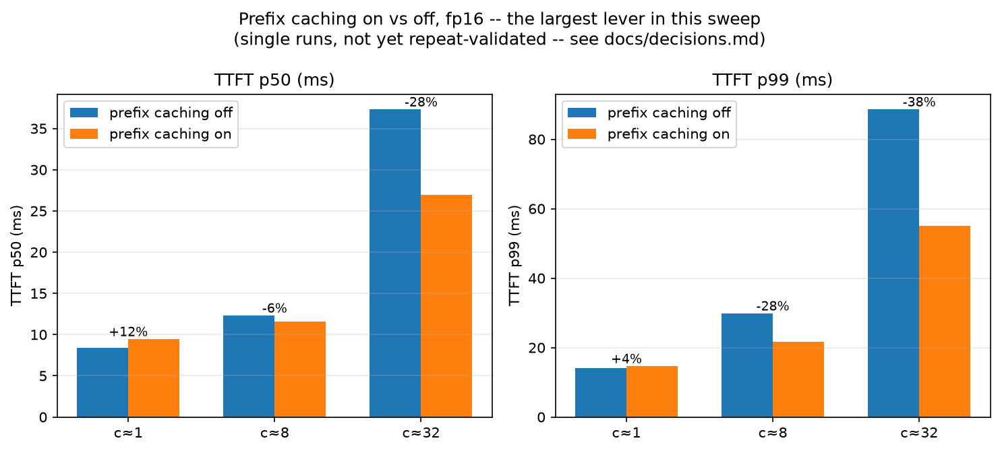
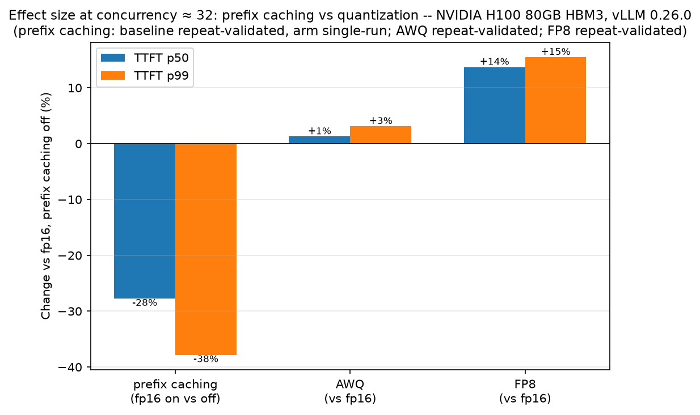
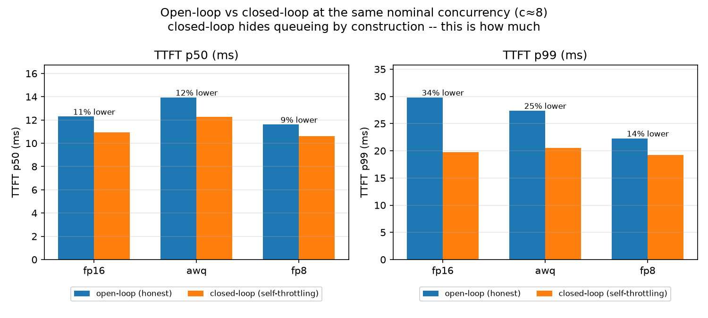
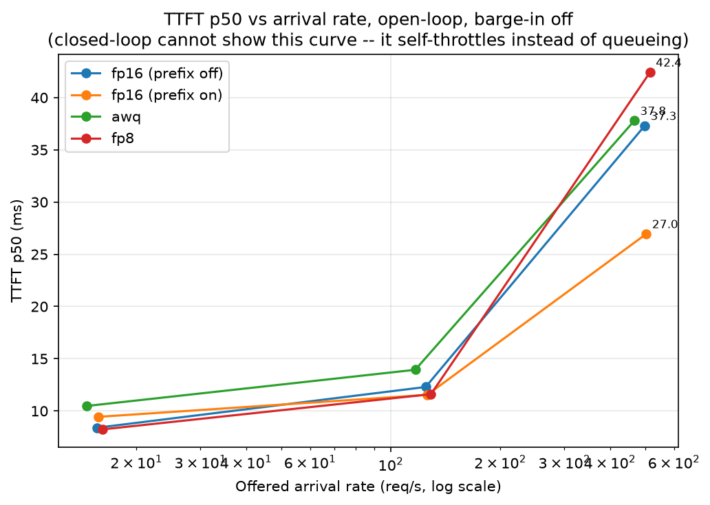
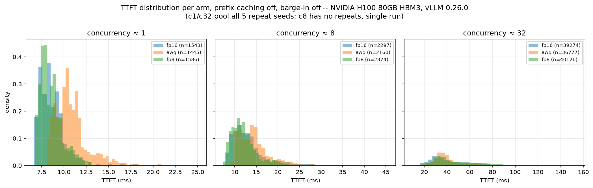
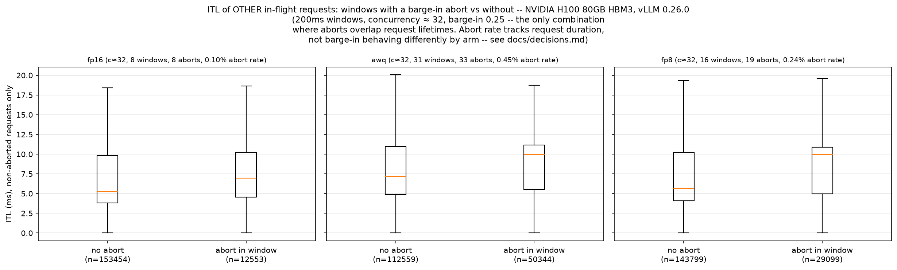

# avatar-inference-bench

Measuring the latency of a real-time conversational AI avatar, and the
cost of the tricks used to make it fast.

Status: Phase 1-3 (LLM serving sweep, calibration, repeat-validation)
ran twice -- once on an H100 pod, again on a differently-provisioned
H200 pod after the first was reclaimed (fp16 + AWQ only; FP8 excluded,
see "H200 results"). Tables and plots below are generated by
`scripts/analyze.py` and `scripts/kv_cache_check.py` from JSON already
committed under `results/`, no GPU or live server involved to reproduce
them. Phase 4 (perplexity, fp16 + AWQ, H200) is done -- see "H200 results"
below. Still pending: Phase 6 (diffusion frame budget, GPU required),
Phase 7 (this README's final pass), Phase 8 (go public). See
`docs/decisions.md` for the full narrative and every non-obvious call
made along the way.

## The H200 run is a fresh baseline, not a continuation

The H100 80GB HBM3 pod behind every number in the Results section below
was stopped and reclaimed. Its replacement runs on a different driver
that caps out at CUDA 12.8 -- a redeploy was attempted specifically to
check whether that was a property of the one pod or of this RunPod
allocation generally; the second pod reports the same driver and the
same container hostname as the first, so the allocation itself is the
ceiling, not a fluke of one pod. That forces vLLM down to 0.19.1 (from
0.26.0), which has two further consequences, not one: a different
attention backend (FlashAttention v3, not flashinfer), and a different
FP8 recipe (W8A8 with dynamic activation scaling, not weight-only
static-scale -- confirmed by reading the resolved quantization config
directly, not assumed from the flag name; see `docs/decisions.md`).

**Four variables differ between the H100 run and the H200 run: GPU,
vLLM version, attention backend, and FP8 semantics.** Not one. **No
table, plot, or claim in this repo mixes numbers from the two.** The
H100 results are kept, not deleted -- they're a prior run on their own
hardware and software, still true for what produced them, labeled with
their own environment block ("Results," below). The H200 run has its
own separate section ("H200 results," further down) -- fp16 and AWQ
only; FP8 is excluded on this environment, see that section for why.
Full reasoning: `docs/decisions.md`, "The H200 run is a fresh baseline,
not a continuation."

## The question

TODO (Phase 4): stated precisely once Phase 1-3 results exist.

## Setup

Two environment blocks below, kept separate deliberately -- see "The
H200 run is a fresh baseline" above for why. The H100 block describes
what actually produced every number in the Results section below it;
the H200 block describes the environment confirmed and ready for the
re-run, whose own results aren't in this README yet.

### H100 (Phase 1-3, prior run -- produced every number in Results below)

- Hardware: RunPod, single H100 80GB HBM3. Driver `580.126.09`, host CUDA 13.0.
- Container: `runpod/pytorch:1.0.2-cu1281-torch280-ubuntu2404` -- a starting
  point, not a description of the environment that actually runs. `pip
  install vllm` replaces its torch build; see below.
- Serving: `vllm serve`, version `0.26.0`, installed via `pip install vllm`
  on the base image -- not the official vLLM Docker image as originally
  planned; see `docs/decisions.md`.
- **Resolved environment: `requirements-pod-h100.txt`** (a `pip freeze`
  off this pod after install) is the source of truth for exact versions,
  not the container tag. Notably: `torch==2.11.0+cu130` (base image
  ships `2.8.0+cu128`; vLLM's dependency resolution upgrades it to CUDA
  13.0 -- this pod's driver, `580.126.09`, supports that), no
  `flash-attn`, `flashinfer-python==0.6.14` as the attention kernel
  backend.
- Model: `Qwen/Qwen2.5-1.5B-Instruct`, plus `Qwen/Qwen2.5-1.5B-Instruct-AWQ`
  and an on-the-fly FP8 variant (`--quantization fp8_per_tensor`).
  **The FP8 arm is weight-only, static-scale, uncalibrated** -- weights
  move to `torch.float8_e4m3fn`, activations stay in bf16. This is a
  different intervention than the calibrated W8A8 (weights *and*
  activations quantized, activation scales fit against a calibration
  dataset) that most published FP8 checkpoints use; see
  `docs/decisions.md` for how that was confirmed. Any FP8 number in this
  README is about the weight-only arm specifically, not FP8 in general.
- Workload: `harness.py` (open/closed-loop load, TTFT/ITL/E2E, barge-in).
- Load design: **offered concurrency is held constant across arms, not
  arrival rate.** Each arm's arrival rate is derived independently via
  Little's Law (`scripts/calibrate.py`, measuring low-load service time
  per arm) to target the same concurrency (~1/8/32) for every arm. See
  `docs/decisions.md` for why this and not the reverse -- it's a
  different experiment, and this is the one that ran.
- `scripts/sweep.sh` orchestrates the full matrix: 3 arms x 3 load points
  x 2 barge-in fractions x prefix-caching on/off (fp16 only) x one
  closed-loop contrast run per arm, restarting the server cleanly and
  confirming a cold cache between every configuration.

### H200 (fresh baseline -- results in "H200 results" below)

- Hardware: RunPod, single H200 SXM 141GB (143771 MiB reported by
  `nvidia-smi`). Driver `570.124.06`, host CUDA 12.8 -- a redeploy was
  attempted to check whether this was one pod's problem; the second pod
  reported the same driver and the same container hostname, so this is
  the allocation's ceiling, not one bad pod.
- Serving: `vllm serve`, version `0.19.1` -- not `0.26.0`. `pip install
  vllm` resolves `0.26.0` + `torch==2.11.0+cu130` here too, same as the
  H100 pod, but this driver only supports CUDA 12.8, so that combination
  can't initialize CUDA at all. `0.19.1` is the newest release whose
  PyPI wheel is still built against CUDA 12.x; confirmed empirically
  (server starts, model loads, serves a request), not just installed.
  See `docs/decisions.md`, "H200 environment rebuild."
- **Resolved environment: `requirements-pod-h200.txt`.** Notably:
  `torch==2.10.0+cu128` (not `2.11.0+cu130`), no `flash-attn` package,
  `flashinfer-python==0.6.6` installed but **not** the attention backend
  actually selected -- vLLM 0.19.1 picks `FLASH_ATTN` (FlashAttention
  v3) here instead.
- Model: same three arms as the H100 run, but **the FP8 arm is a
  different intervention, not the same flag on newer hardware.**
  `--quantization fp8_per_tensor` (the H100 flag) isn't confirmed to
  exist in 0.19.1; the working flag is bare `--quantization fp8`, and
  it resolves to **W8A8 with dynamic activation scaling** -- weights
  *and* activations both move to `torch.float8_e4m3fn`, scale
  recomputed every forward pass. Confirmed by reading the live resolved
  `Fp8Config` object (`activation_scheme: dynamic`,
  `is_checkpoint_fp8_serialized: False`), not assumed from the flag
  name. The H100's FP8 arm was weight-only with a static scale,
  activations left in bf16 -- a different recipe. See
  `docs/decisions.md`, "FP8 on vLLM 0.19.1," for the full check and why
  this changes what the H200 FP8 arm's numbers should be expected to
  look like.
- AWQ auto-selects `awq_marlin` -> `MacheteLinearKernel` here (recorded
  now; no H100-side capture exists yet to compare against).
- **FP8 is currently broken on this environment, not just a different
  recipe -- excluded from the sweep pending a fix.** The calibration
  checkpoint showed FP8 responses averaging ~4x more tokens than
  fp16's; checked four ways (`finish_reason`, chat template, EOS/
  sampling config, raw output text) before concluding anything, per
  `docs/decisions.md`, "FP8's ~4x token-length gap is not a
  quantization effect -- it's a bug." Confirmed: FP8 never reaches EOS
  (0 `stop` / 76 `length` in a live sample; fp16: 221 `stop` / 1
  `length`) because it's generating corrupted, mixed-script token soup
  from the first token, not degraded-but-coherent text -- ruled out
  chat-template and EOS-config differences directly (both confirmed
  identical to fp16's). **FP8's calibration-derived rates
  (5.46 / 43.72 / 174.87 req/s) are not valid** -- they're Little's Law
  reading a corrupted-output service time as if it were real. Not used
  for anything, not comparable to the other arms' rates.
- Workload, load design, and sweep orchestration: same `harness.py` /
  `scripts/calibrate.py` / `scripts/sweep.sh` design as the H100 run,
  with four methodology improvements folded in before this run rather
  than repeating the H100 sweep's design as-is -- scaled barge-in
  window, server startup logs captured per run, repeats built into the
  matrix, and a file-classification assertion in `scripts/analyze.py`.
  See `docs/decisions.md`, "Sweep v2."
- Results (fp16 + AWQ; FP8 excluded per the finding above): see "H200
  results" below.

## Results

Generated by committed scripts reading only `results/*.json` -- nothing
below is hand-typed. Reproduce with `make analyze` (tables + plots) and
`make kv-check` (KV cache arithmetic). Full matrix: `results/summary.md`.
Full narrative, predictions stated before measuring, and the
repeat-validated noise bands: `docs/decisions.md`.

**The headline finding: prefix caching, not quantization, is this
sweep's largest lever.**



fp16 with prefix caching on vs off at concurrency ~= 32: TTFT p50 28%
lower, p99 38% lower with caching on -- both several times larger than
any quantization effect measured here. Single-run, not yet
repeat-validated; the direction and rough magnitude aren't in doubt, the
exact percentages might move a few points on a repeat pass. The plot
above makes the on/off comparison directly, but not the "larger than
quantization" half of the claim -- that comparison needs both effects in
the same frame:



-27.8%/-37.8% (prefix caching) against +1.3%/+3.1% (AWQ) and
+13.7%/+15.5% (FP8, weight-only) at the same load point -- prefix
caching's effect is roughly double FP8's and an order of magnitude past
AWQ's, in the direction that helps.

**Quantization, repeat-validated (5 seeds, concurrency ~= 1 and ~= 32,
prefix caching off):**

| | c~=1 (p50) | c~=32 (p50) |
|---|---|---|
| fp16 | 8.39 +/- 0.05ms | 37.31 +/- 2.43ms |
| AWQ | 10.47 +/- 0.37ms | 37.79 +/- 0.76ms |
| FP8 (weight-only) | 8.23 +/- 0.11ms | 42.43 +/- 2.05ms |

AWQ is clearly slower at low load (dequant overhead, never
bandwidth-bound at this batch size); at c~=32 the fp16/AWQ gap (0.48ms)
is inside fp16's own run-to-run noise (+/-2.43ms) -- no measurable
difference, and no crossover, despite what a single run of each looked
like. FP8 (weight-only) is real in both directions: marginally faster at
low load, ~14% slower at high load once the workload turns compute-bound.
Full mechanism discussion in `docs/decisions.md`.

**Open-loop vs closed-loop, quantified:**



At the same nominal concurrency (c~=8), closed-loop's self-throttling
makes every arm look 9-12% better at p50 and 14-34% better at p99 than
the open-loop number the same server actually produced. This is why the
sweep is open-loop by design -- closed-loop is reported only as this
contrast, never as a headline number.



fp16's own progression across load levels (prefix caching off, barge-in
off) makes the case directly: TTFT p50 climbs 8.39ms (c~=1, repeat mean)
-> 12.29ms (c~=8) -> 37.31ms (c~=32, repeat mean) purely from queueing
delay that a closed-loop driver would have hidden by self-throttling
instead of letting requests queue.

**TTFT distribution per arm, and barge-in's effect on neighbors:**




Barge-in only overlaps a request's lifetime at concurrency ~= 32 in this
sweep -- at c~=1/c~=8, requests finish faster than the sampled abort
delay (0.3-1.2s), so no abort ever fires there. At c~=32, ITL for
requests sharing a 200ms window with an abort runs measurably higher
than requests in windows without one, across all three arms -- barge-in
has a real cost to bystanders, not just to the interrupted request.

The three arms' abort counts differ a lot (fp16 8, AWQ 33, FP8 19) --
that's exposure, not barge-in behaving differently: the same fixed
0.3-1.2s abort delay only fires on a request still in flight, and how
often that happens tracks each arm's own decode speed at this load
point (AWQ is the slowest of the three here, same finding as the
quantization table above, showing up a second way). The within-arm
with/without comparison the plot makes is unaffected; see
`docs/decisions.md` for the full check.

## What these numbers do not prove

- Everything above is Qwen2.5-1.5B-Instruct on a single H100 80GB
  HBM3, vLLM 0.26.0, concurrency approximately 1/8/32 (not the full
  0-32 range), prefix caching off unless stated otherwise. None of it
  generalizes to other model sizes, other hardware, or load levels
  between or beyond the three tested here without saying so.
- **Hardware-locked, and this already happened once:** this section
  originally stated as a hypothetical that a future run on different
  silicon wouldn't be comparable to these results. It's no longer
  hypothetical -- the H100 pod is gone, and the replacement isn't just
  different hardware: GPU, vLLM version, attention backend, and FP8
  semantics all differ from what produced the numbers above. See "The
  H200 run is a fresh baseline" near the top of this file. Phase 1-3 is
  being re-run as a fresh baseline, not extended in place.
- The prefix-caching effect (this sweep's largest finding) is single-run,
  not yet repeat-validated the way the quantization comparison is.
- The KV cache arithmetic check (`scripts/kv_cache_check.py`,
  `results/kv_cache_check.md`) has no committed vLLM-reported figure to
  verify against -- see `docs/decisions.md`. The numbers there are
  correct arithmetic and a stated upper bound, not a confirmed match.
- FP8 here is weight-only, static-scale, uncalibrated -- not the
  calibrated W8A8 most published FP8 checkpoints use. See Setup above.
- Perplexity/quality was never measured on this H100 run. It has since
  been measured on the H200 run instead (see "H200 results" below, Phase
  4) -- not a gap this section's H100 numbers ever get retroactively
  paired with, since nothing here mixes H100 and H200 numbers.

## H200 results (fp16 + AWQ; FP8 excluded)

Environment: RunPod H200 SXM 141GB, vLLM 0.19.1, torch 2.10.0+cu128,
FlashAttention v3, Qwen2.5-1.5B-Instruct (+ AWQ). Full detail in the H200
Setup block above. **This section and the H100 section above it describe
two different environments -- GPU, vLLM version, torch, attention
backend, and FP8 semantics all differ between them. Every table below is
H200-only. No claim in this section is a comparison to the H100 numbers
unless stated as one explicitly, and none of them are stated as one.**
Data: `results/h200/`, generated by `scripts/analyze.py --results-dir
results/h200`. Full narrative: `docs/decisions.md`.

### Reading this section: two predictions already didn't survive repetition

Before the individual findings: this project has now seen two
pre-registered, single-run effects fail to reproduce once repeat runs or
a repeat-validated comparison point existed. On the H100 sweep, a single
run of each arm showed AWQ overtaking fp16 at high concurrency -- a
"crossover." Five repeats per arm showed the gap was inside fp16's own
run-to-run noise; there was no crossover, just noise that looked like
one in a single sample. On the H100 sweep's prefix-caching effect, a
single run at concurrency ~=1 showed caching *on* performing worse than
caching *off* -- a reversal from the effect's own direction at every
other load level. The H200 sweep re-measured the equivalent point with
5 repeats, and the reversal is gone (inside noise, see below).

Neither of these was a mistake in the original measurement -- both were
real single-run numbers, honestly reported at the time. The pattern is
the finding: **an effect near the noise floor, measured once, is not
distinguishable from noise, and a plausible-sounding mechanism can be
constructed for either one after the fact.** Every number below states
whether it's a single run or repeat-validated, and that distinction is
the single most load-bearing piece of information in this section --
more so than any individual percentage.

### 1. Prefix caching is still the largest lever (repeat-validated at c≈32)

At concurrency ~=32, prefix caching on vs off: TTFT p50 -32.8%, p99
-39.8%. The off-arm side of this comparison is repeat-validated (5
seeds, 45.59 +/- 2.81ms); the on-arm side is a single run (30.62ms), so
the exact percentage could move somewhat on a repeat pass, but the
direction and rough magnitude are not in doubt -- this matches the
H100 sweep's own finding at the same load point (-27.8% p50 / -37.8%
p99 there), same direction, comparable-to-larger magnitude on H200.

**The H100 sweep's concurrency ~=1 reversal (caching on measurably
*worse*, +12.4%/+4.4%) does not reproduce on H200.** At c~=1 on H200,
both arms are repeat-validated (5 seeds each): off 11.29 +/- 0.18ms, on
11.35ms (+0.5% p50, -0.6% p99) -- inside the off-arm's own noise band.
Attributed to noise, not to a real mechanism that stopped applying: the
H100 number was never itself repeat-validated, and the one repeat-
validated version of this same comparison shows no effect.

### 2. AWQ crosses over at high load on H200 -- contradicts the pre-registered prediction

| Concurrency | fp16 | AWQ | Gap |
|---|---|---|---|
| c~=1 (5 seeds each) | 11.29 +/- 0.18ms | 12.93 +/- 0.18ms | AWQ +14.5% slower |
| c~=32 (5 seeds each) | 45.59 +/- 2.81ms | 35.76 +/- 0.73ms | AWQ -21.6% faster |

Both points are repeat-validated on both arms, and both gaps are well
outside the combined noise bands.

The low-load penalty persists in direction (AWQ slower), matching the
H100 result (+24.8% there), though smaller in relative size (+14.5%
here) than the pre-registered prediction called for: *"AWQ's relative
low-load penalty should hold or widen, not shrink."* It held in
direction; it shrank in magnitude.

The high-load result **contradicts** the prediction as stated for that
arm specifically. The general H200 prediction did name this outcome as
possible -- *"A same-or-larger benefit at c~=32 would be the surprise,
not the null result"* -- but the default expectation, and the
AWQ-specific reasoning (dequant overhead is a fixed compute cost,
unaffected by more VRAM), pointed at no meaningful high-load difference,
the same as what H100 actually showed. What H200 shows instead is a
clear ~21.6% AWQ advantage, repeat-validated on both sides.

**Candidate mechanism, stated as a hypothesis, not confirmed by
profiling:** if concurrency ~=32 is memory-bandwidth-bound rather than
compute-bound, AWQ's int4 weights move roughly 4x less data per forward
pass than fp16's bf16 weights -- a real bandwidth win if bandwidth is
the bottleneck at that batch size. This is the same mechanism the H100
FP8 prediction used to explain that arm's own (weight-only, different
recipe) high-load result, now potentially applying to AWQ instead, on
hardware with more bandwidth headroom to exploit it. An untested
alternative: H200's `awq_marlin`/`MacheteLinearKernel` kernel path
(`results/h200/server_log_awq.txt`) may simply be better-optimized than
whatever ran on the H100 sweep, independent of any bandwidth argument.
Neither has been checked with a profiler. The result itself -- direction
and magnitude -- is not in question; the mechanism is open.

**What that speed costs: AWQ's perplexity on a fixed wikitext-2 slice is
8.26% higher than fp16's (10.5145 vs 9.7118, `results/h200/
perplexity_awq.json` / `perplexity_fp16.json`) -- 5 repeats per arm, every
repeat bit-identical (stdev 0.0), so this delta is not noise, full stop.**
Paired with the table above: **at c~=32, AWQ trades that 8.26% quality
cost for a 21.6% latency win -- a real trade, not a free one.** At c~=1,
AWQ pays the same 8.26% quality cost *and* the 14.5% latency penalty --
worse on both axes, never a good choice at low load. The quality cost
itself doesn't vary with load (it's baked into the weights, not the
batch); whether it buys anything back is entirely a function of where on
the load curve you're operating. Full methodology, the pre-registered
prediction, and why wikitext perplexity is a proxy for representational
quality, not a validated measure of this project's actual multi-turn
conversational output: `docs/decisions.md`, "Phase 4 perplexity results."

### 3. FP8 excluded: corrupted output, not a quantization effect

vLLM 0.19.1's online FP8 (`--quantization fp8`, W8A8 with dynamic
activation scaling -- see the H200 Setup block) produces incoherent
output from the first generated token, not degraded-but-readable text.
Sample, same system prompt and user turn, same seed, both arms,
`max_tokens=80`:

- **fp16:** *"It's okay to spend time on thoughts that matter to you.
  What is the thought or idea you've been pondering? Sometimes talking
  through what's on your mind can help clear things up."* --
  `finish_reason: stop`, 40 tokens.
- **FP8:** *"袅 解.Resolve";} yabǃ qualidade感じるolving (...ñas andaLab
  yab standardized zwe..."* -- `finish_reason: length`, 80 tokens (never
  reached EOS).

Checked four ways before concluding this (`docs/decisions.md`, "FP8's
~4x token-length gap is not a quantization effect -- it's a bug"): chat
template and EOS/sampling config are confirmed byte-identical to fp16's;
`finish_reason` is 0 `stop` / 76 `length` in a live sample (fp16: 221
`stop` / 1 `length`); the raw output is garbled from the first token
across multiple prompts and seeds, including at `max_tokens=8`, ruling
out late-sequence drift. **This is a defect in vLLM 0.19.1's serving
implementation of online FP8, not a property of FP8 quantization as a
technique** -- genuine quantization noise degrades coherence at the
margins, it does not produce multi-script token soup with 100% of
samples hitting the generation cap. Filed as issue #29. A quick
follow-up test (forcing a static activation scale via `--hf-overrides`)
did not fix it and is not a one-flag workaround -- see the issue for why.
FP8 is excluded from every H200 table in this document; nothing here
claims to measure it.

### 4. Barge-in now lands at every load level (methodology fix, confirmed)

| | c~=1 | c~=8 | c~=32 |
|---|---|---|---|
| H100 fp16 abort rate (fixed 0.3-1.2s window) | 0% | 0% | 0.10% |
| H200 fp16 abort rate (window scaled to 25-75% of calibrated service time) | 25.5% | 25.4% | 27.5% |

The fixed-window design meant barge-in was effectively only tested at
one of three load points on the H100 sweep -- the abort delay was
longer than the response itself at low and mid load, so it essentially
never fired before the request completed on its own. Scaling the window
to each arm's own calibrated service time fixes this: observed abort
rates now match the sampled 25% fraction closely at every concurrency.

**Caveat at c~=32, disclosed rather than smoothed over:** the window is
sized off *unqueued* service time (the concurrency=1 calibration probe).
At c~=32, queueing measurably inflates actual wait time, so a real
fraction of aborts land during the queueing/TTFT phase rather than
post-TTFT decode -- `abort_before_first_token` is 0-0.9% at c~=1/c~=8
(aborts land mid-decode, as intended) but 11.6-26.5% at c~=32. This was
predicted in `scripts/sweep.sh`'s own comment before this run, not
discovered after the fact.

### 5. KV-cache arithmetic validated (first time this check has had anything to check against)

Expected bytes per token, from the model's own config (28 layers, 2 KV
heads, 128 head_dim, bf16/fp16 -- both 2 bytes):

```
28 layers x 2 KV heads x 128 head_dim x 2 (K and V) x 2 bytes = 28,672 bytes/token
```

`results/h200/server_log_fp16_pcoff.txt` and `server_log_awq.txt`
(committed server startup logs -- issue #19) report vLLM's own KV cache
allocation directly: `Available KV cache memory: 120.53 GiB`, `GPU KV
cache size: 4,513,888 tokens` (fp16); `122.29 GiB`, `4,579,824 tokens`
(AWQ). Dividing gives vLLM's own implied bytes/token: **28,671.09**
(fp16), **28,670.95** (AWQ) -- against **28,672** expected, agreement to
within the rounding vLLM's own log applies before printing "GiB" to two
decimal places.

**This validates bytes-per-token, not a per-sequence or per-max-context
figure.** `GPU KV cache size: 4,513,888 tokens` is a total pool size, in
tokens, that vLLM's paged allocator draws blocks from as needed --
sequences reserve blocks for tokens they've actually generated, not for
the model's full 32,768-token context length up front. A per-sequence
figure at full context (`scripts/kv_cache_check.py`, `results/
kv_cache_check.md`) is a separate, upper-bound calculation; this check
is a direct measurement of the pool vLLM actually allocated, and it
matches the per-token arithmetic exactly.

### Data integrity: one run was excluded and re-run, disclosed here

`fp16_pcoff_open_c8_bargein0.0` initially returned from the sweep with
TTFT p99 = 5.3 seconds -- 581 of 2178 requests took over 1 second to
first token, decaying roughly linearly from ~5.1s mean at the start of
the run to steady-state ~16ms by 7 seconds in, then flat for the
remaining 13 seconds. Checked against every other one of the 34 other
result files' own load-level transitions, including AWQ's and fp16
(prefix-caching-on)'s own concurrency 1 -> 8 jumps: none show anything
resembling this pattern (worst case elsewhere: tens of milliseconds).
Isolated to this one run. Re-ran the identical configuration once, on a
freshly started server: clean (p50 14.9ms, p99 41.4ms, in line with
every other concurrency-8 cell). **The committed file
(`results/h200/fp16_pcoff_open_c8_bargein0.0.json`) is the clean re-run,
not the original.** Excluding a one-off outlier that doesn't recur
anywhere else in the sweep is a normal part of running one; not
disclosing that it happened is not.

## What's next

- H200 fp16 + AWQ sweep complete (see "H200 results" above). FP8
  excluded pending issue #29 (vLLM 0.19.1's own online-FP8 defect, not
  something fixable in this repo) -- revisit if a fix or a different
  vLLM version becomes available on this allocation.
- H200's prefix-caching effect at c~=32 is still single-run on the
  caching-*on* side (the *off* side is repeat-validated); repeat-
  validating the *on* side would close the same gap the H100 sweep's
  prefix-caching number still has.
- Phase 4 done: perplexity, fp16 + AWQ, fixed wikitext-2 slice, noise
  band came back exactly zero (see "H200 results" above and
  `docs/decisions.md`). FP8 excluded, same reason as the latency sweep.
- Phase 6 (GPU required): diffusion frame budget.
- Phase 7: final README pass once Phase 6 lands.
- Phase 8: go public, update resume.
